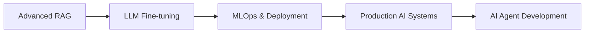

<div align="center">

# 👋 Hi, I'm Kalyan Sai Atchi

### 🤖 Full-Stack AI Developer | Passionate on Building Gen AI Applications | Exploring AI Agents


[](https://www.linkedin.com/in/kalyan-sai-atchi-45539926a/)
[](https://kalyansai3114-protfolio.netlify.app/)
[](https://leetcode.com/u/KALYANSAI3114/)
[](mailto:kalyansai0909@gmail.com)

</div>

---

## 🚀 About Me

```python
class AIEngineer:
    def __init__(self):
        self.name = "Kalyan Sai Atchi"
        self.role = "AI Engineer & ML Specialist"
        self.education = {
            "degree": "B.Tech Computer Science & Engineering",
            "specialization": "IoT & Cybersecurity",
            "university": "VVITU",
            "cgpa": "8.25/10"
        }
        self.current_focus = [
            "Building Production-Ready RAG Systems",
            "LLM Fine-tuning & Prompt Engineering",
            "End-to-End ML Pipelines"
        ]
        
    def say_hi(self):
        print("Thanks for dropping by! Let's build something amazing together!")

me = AIEngineer()
me.say_hi()
```

🎯 **Completed:** AI Engineer Intern @ KodeMelon Technologies  
💡 **Passionate About:** Transforming complex AI research into practical, scalable solutions  
🔭 **Working On:** Advanced RAG systems and production-grade LLM applications  
🌱 **Learning:** Cutting-edge techniques in Generative AI and MLOps  

---

## 💼 Professional Experience

### 🏢 AI Engineer Intern | KodeMelon Technologies
**Aug 2025 – Dec 2025**

🔹 **Built a full-stack image analytics platform** integrating face detection, emotion classification, and vector similarity search  
   → Served 1000+ queries with 90% retrieval accuracy improvement

🔹 **Engineered production-ready LLM chatbot** using BERT embeddings and Sarvam API  
   → Deployed Flask-based solution reducing client response time by 45%

🔹 **Automated lead generation pipeline** extracting 200+ client leads through intelligent web scraping

---

## 🛠️ Tech Arsenal

### 🤖 AI & Machine Learning


**Core Expertise:** RAG Systems | LLM Integration | NLP | Computer Vision | Prompt Engineering

### 📊 Data Science & Analytics


### 🌐 Full-Stack Development


### 🗄️ Databases & Storage


### 🛠️ DevOps & Tools


---

## 🎯 Featured AI Projects

### 🎓 [alaBAI – The EduBuddy](https://alabai-the-edubuddy.onrender.com/)
> **AI-powered learning companion eliminating context-switching friction**

🔧 **Tech Stack:** Python • Flask • Gemini API • HTML/CSS/JS  

✨ **Highlights:**
- Dual-panel architecture with AI-generated summaries + embedded code editor
- Smart resource curation using LLMs for top 5 educational materials
- Zero context-switching learning experience for technical education

---

### 💬 [CollegeBot – RAG-Based Chatbot](https://collegebot-3114.streamlit.app)
> **Intelligent Q&A system for college information retrieval**

🔧 **Tech Stack:** LangChain • ChromaDB • Sarvam AI • Streamlit • BeautifulSoup  

✨ **Highlights:**
- End-to-end RAG pipeline: web scraping → chunking → embedding → retrieval
- Semantic search with ChromaDB vector database
- LLM-powered response generation with source attribution
- Deployed on Streamlit for real-time user interaction

---

### 🔐 [Behavioral Biometrics](https://github.com/KALYANSAI-3114/Behavioral_Biometrics)
> **ML-based fraud detection through keystroke dynamics**

🔧 **Tech Stack:** Scikit-learn • Flask • MySQL • Random Forest • SVM  

✨ **Highlights:**
- Analyzes keystroke patterns and location data for user authentication
- Full-stack web application with real-time ML inference
- Enhanced security beyond traditional credential-based systems

---


## 🏆 Achievements & Certifications

🎓 **Google AI Essentials** – Google via Coursera (May 2024)  
☁️ **Introduction to Generative AI** – Google Cloud (Apr 2024)  
💻 **100+ LeetCode Problems** – Data Structures & Algorithms  
🏅 **Top 1% Academic Rank** – CSE Department, VVITU  

---

## 🌟 Leadership Journey

### 👥 Human Resource Council Member | Student Activity Council, VVIT
**Mar 2024 – Oct 2024**

- Led cross-functional team of 120+ members and 300+ volunteers
- Digitized workflow systems, improving event coordination by 25%

### 🎓 Alumni Council Member | Student Activity Council, VVIT
**Mar 2023 – Mar 2024**

- Connected 500+ students with industry mentors
- Enhanced alumni engagement by 40% through data-driven initiatives

---

## 📈 Current Learning Goals



🔍 **Exploring:** Multi-modal AI, Agent-based systems, Advanced prompt engineering  
🎯 **Next:** Building autonomous AI agents and scaling ML infrastructure

---

## 💬 Let's Connect!

<div align="center">

I'm always excited to collaborate on AI/ML projects or discuss innovative ideas!

**📧 Email:** kalyansai0909@gmail.com  
**🔗 LinkedIn:** [Connect with me](https://www.linkedin.com/in/kalyan-sai-atchi-45539926a/)  
**🌐 Portfolio:** [View my work](https://kalyansai3114-protfolio.netlify.app/)  
**💻 LeetCode:** [KALYANSAI3114](https://leetcode.com/u/KALYANSAI3114/)


</div>

---

<div align="center">

### ⚡ "Transforming AI research into real-world impact, one project at a time" ⚡

**⭐️ From [KALYANSAI-3114](https://github.com/KALYANSAI-3114)**

</div>
